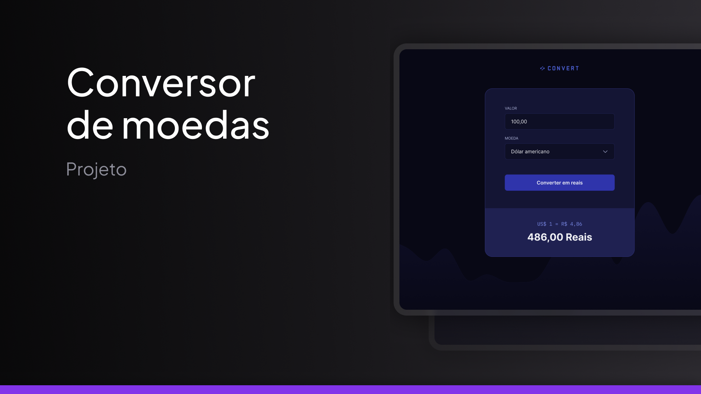
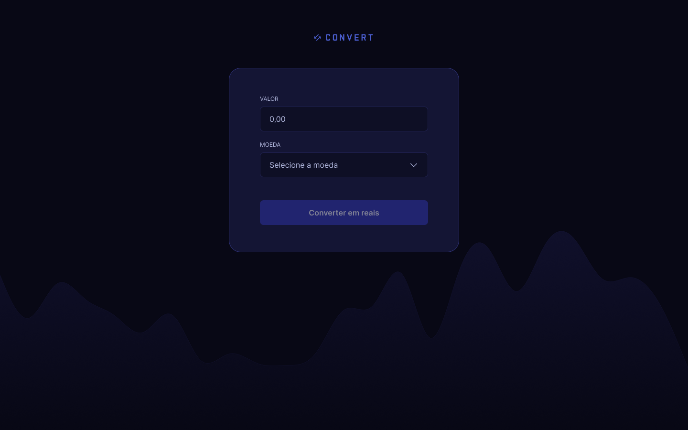
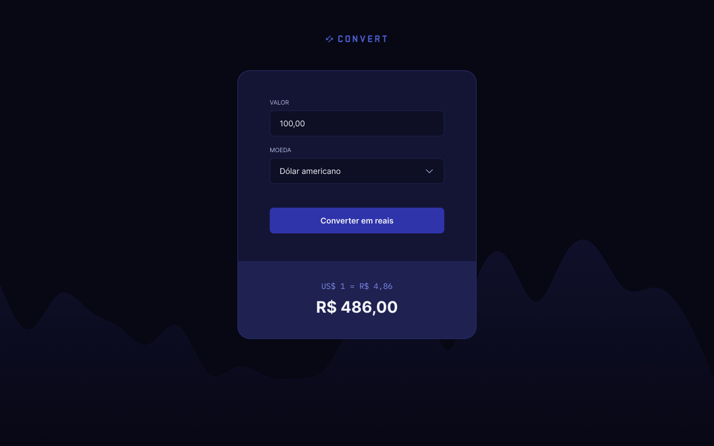

# Descrição do projeto

Este projeto é um conversor de moeda que permite ao usuário inserir um valor e selecionar a moeda de destino (USD, EURO ou GBP) para realizar a conversão.

## Tecnologias Utilizadas

- HTML;
- CSS;
- JavaScript;

### Instalação

Para executar o projeto, é necessário ter o Node.js instalado em sua máquina. Se você não tiver o Node.js instalado, siga os passos abaixo:

1. Baixe o instalador do Node.js no site oficial: https://nodejs.org/en/download/

2. Execute o instalador e siga as instruções de instalação.

### Uso

1. Clone o repositório do projeto em sua máquina local.

2. Abra o arquivo `index.html` no navegador para acessar a interface do conversor.

3. Insira o valor que deseja converter e selecione a moeda de destino.

4. Clique no botão "Converter" para realizar a conversão.

#### Galeria

##### Padrão

##### Resultado
